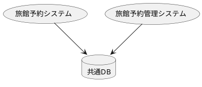
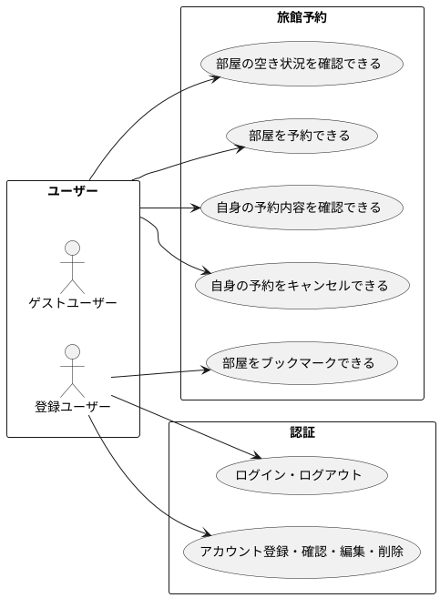
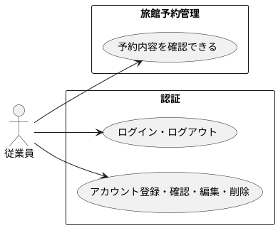

# 旅館予約システム

## コンテキストマップ

```plantuml
@startuml
  usecase  "旅館予約システム" as mainSys
  usecase  "旅館予約管理システム" as adminSys
  database "共通DB" as db

  '---------------------------------------
  mainSys --> db
  adminSys --> db
@enduml
```

## ユースケース

### 旅館予約システム

```plantuml
@startuml
  left to right direction
  rectangle  "旅館予約" as mainSys {
    usecase "部屋の空き状況を確認できる" as u1
    usecase "部屋を予約できる" as u2
    usecase "自身の予約内容を確認できる" as u3
    usecase "自身の予約をキャンセルできる" as u4
    usecase "部屋をブックマークできる" as u5
  }
  rectangle  "認証" as authSys {
    usecase "ログイン・ログアウト" as u7
    usecase "アカウント登録・確認・編集・削除" as u8
  }


  '========================================
  rectangle  "ユーザー" as user {
    actor "ゲストユーザー" as guestUser
  }
  '========================================
  user --> u1
  user --> u2
  user --> u3
  user --> u4


  '========================================
  rectangle  "ユーザー" as user {
    actor "登録ユーザー" as registeredUser
  }
  '========================================
  registeredUser --> u5
  registeredUser --> u7
  registeredUser --> u8
@enduml
```

### 旅館予約管理システム

```plantuml
@startuml
  left to right direction
  rectangle  "旅館予約管理" as mainSys {
    usecase "予約内容を確認できる" as u1
  }
  rectangle  "認証" as authSys {
    usecase "ログイン・ログアウト" as u3
    usecase "アカウント登録・確認・編集・削除" as u4
  }


  '========================================
  actor "従業員" as employee
  '========================================
  employee --> u1
  employee --> u3
  employee --> u4

@enduml
```
